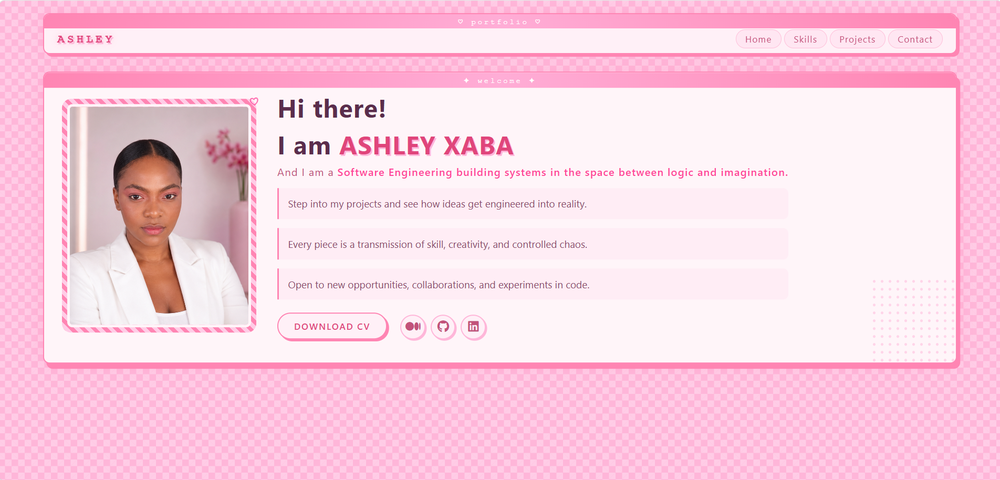
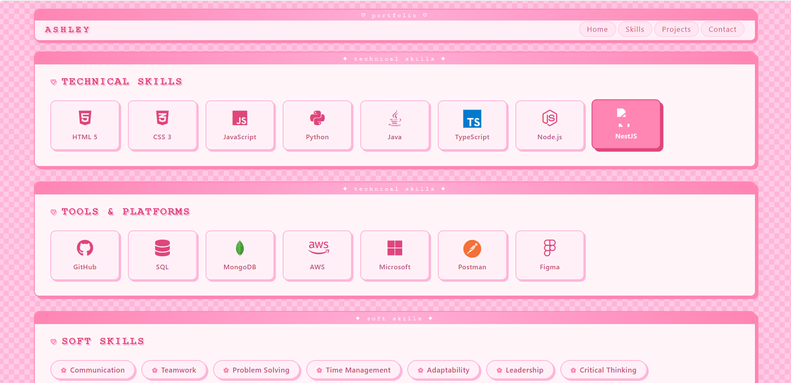
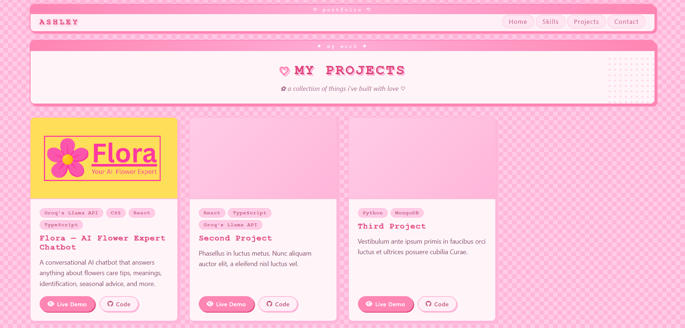
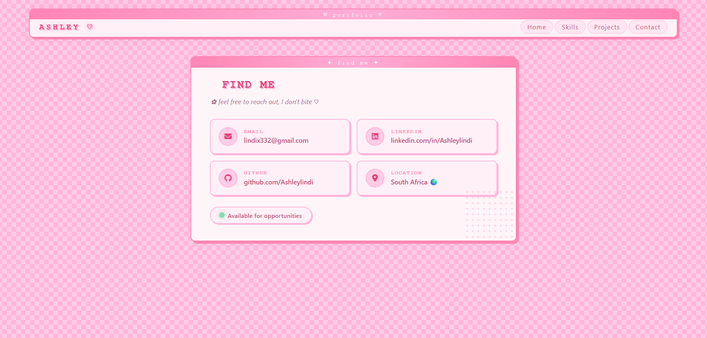

# 🌸 Portfolio Website 🌸

### ✧･ﾟ: *Neocities-inspired retro pink portfolio* *:･ﾟ✧

    
    

---

## 🌐 Live Site
👉 **View Portfolio:** *(insert your hosted link here)*

---

## ✨ About This Project

A personal portfolio website designed with a **soft pink retro aesthetic** inspired by Neocities-era web design.

It showcases:
- My skills as a developer 💻  
- My projects 📁  
- My contact info 📧  
- A nostalgic web experience 🌸  

---

## 🖥️ Screenshots

### 🏠 Home Page

✨ Retro pink landing page with intro vibes

---

### 💻 Skills Page

🎀 Clean layout showcasing HTML & CSS skills

---

### 📁 Projects Page

💗 Card-style project showcase with hover effects

---

### 💌 Contact Page

🌸 Simple and aesthetic contact section

---

## 🛠️ Built With

---

## 🎀 Features

✨ Retro Neocities-inspired design  
💖 Soft pink aesthetic theme  
📱 Multi-page layout  
🌸 Smooth hover interactions  
🖥️ Lightweight static site  
🎧 Nostalgic web vibe  

---

## 📬 Contact Me

📧 Email: **lindix332@gmail.com**  
💼 LinkedIn: **https://www.linkedin.com/in/ashleylindi**  
🐙 GitHub: **https://github.com/Ashleylindi**

---

## 🌷 Visitor Vibes

  
  
  

✧･ﾟ: * thanks for visiting my digital space *:･ﾟ✧
---

## 📄 License

© Ashley Xaba. All rights reserved.

---
